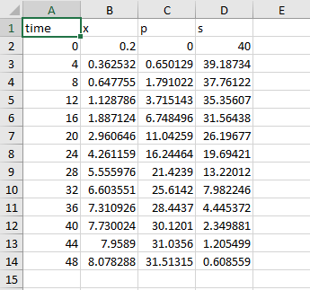

# GAFerm
This GitHub page contains the code used to developed the GAFerm app. A Shiny web application that can be used for the simulation and optimization of fermentation processes. This app allow you to use six different growth kinetic models to simulate fermentation processes in different operation conditions. Also you can use Genetic Algorithms to carry out parametric optimization and to find the optimal inflow rate to a feed batch bioreactor.

## Format
The input data that must be introduced to the app in the "Optimization -> kinetic parameters" seccion should have the following format. 

Excel (extension .xlsx) file with four columns. The column names are: time, x, s and p. The order may be different  

## User interface 

